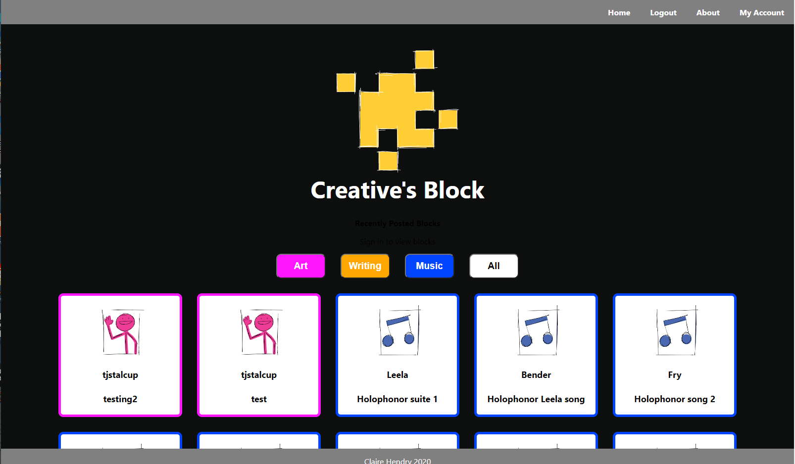
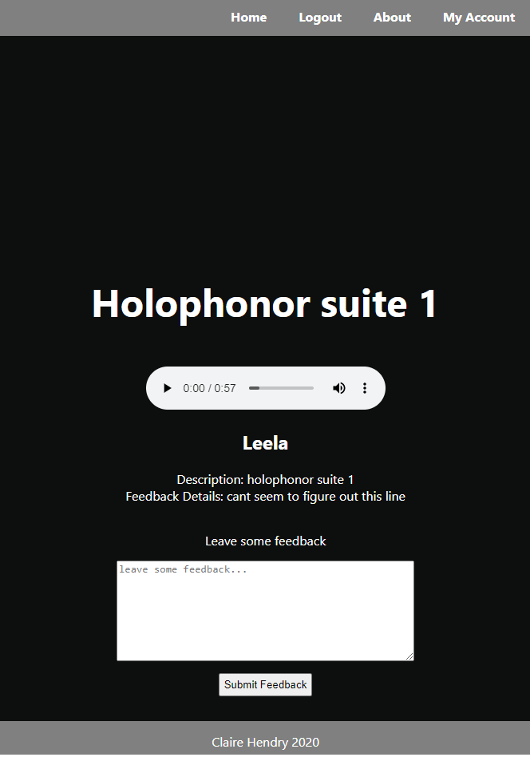

# Creative's Block
---------------------------------------------
Creative's Block is a community-based platform to provide artists, writers, and other creatives constructive feedback on projects (or "blocks") and ideas.

## Live App [Here](https://creatives-block-client.vercel.app/)

------

## API Documentation

GET /blocks/recent-blocks - See recently posted blocks from all users. If logged in, user can access block details and leave feedback.

GET /blocks/:category/:block_id - See specific block.

GET /recent-blocks/:user_name - See all blocks posted by specific user.

GET /feedback/:block_id - Get feedback on user's own blocks.

POST /feedback/:block_id - Post new feedback on other users' blocks.

POST /blocks/upload - Post new block to user's account.

POST /users - Register new user.

POST /auth/login - Login existing user.

------

## Summary

Creative's Block is a service designed to facilitate the creative process by allowing users to post work in progress projects, and gain critical feedback from a community of other creatives. Registration and uploading content are free and open to most forms of media; specifically visual art (2D, video, animation), writing, and music.

Currently accepted forms of media include jpeg, png, gif, mp4, pdf, doc, mp3.

------

## Screenshots

------

## Technology Used

This service is build with ReactJS, Node, Express, and PostgreSQL.

Hosted using Heroku and Vercel.

## Set Up

Complete the following steps to start a new project:

1. Clone this repository to your local machine `git clone cd` into the cloned repository
2. Make a fresh start of the git history for this project with `rm -rf .git && git init`
3. Install the node dependencies `npm install`
4. Move the example Environment file to `.env` that will be ignored by git and read by the express server `mv ./src/example.env .env`

-------

## Scripts

Start the application `npm start`

Start nodemon for the application `npm run dev`

Run the tests `npm test`

-------
